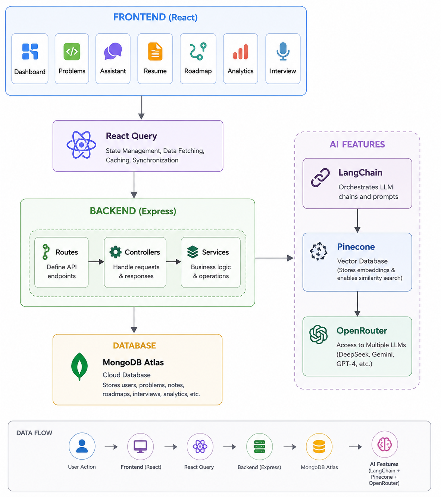

# 🚀 CodePrep

AI-powered interview preparation platform designed to help aspiring software engineers prepare for technical interviews through personalized roadmaps, AI-assisted learning, resume analysis, mock interviews, progress tracking, and performance analytics.

## 🌐 Live Demo

**Application:** https://code-prep-beta.vercel.app/

**Frontend Hosting:** Vercel

**Backend Hosting:** Render

**Repository:** https://github.com/rudraksh-mall/CodePrep

---

# 👨‍💻 Contributors

* Rudraksh Mall
* Rajeev

---

# 📖 Overview

Preparing for technical interviews often requires managing multiple resources, tracking progress across topics, identifying weak areas, practicing coding problems, and receiving meaningful feedback.

CodePrep centralizes the entire interview preparation journey into a single AI-powered platform. It combines Large Language Models (LLMs), Retrieval-Augmented Generation (RAG), vector search, analytics, and personalized learning workflows to help users prepare more effectively for software engineering interviews.

---

# ✨ Features

| Feature             | Description                                   | Status |
| ------------------- | --------------------------------------------- | ------ |
| Authentication      | JWT-based authentication and authorization    | ✅      |
| AI Assistant        | Context-aware interview preparation assistant | ✅      |
| Resume Analyzer     | AI-powered resume evaluation and feedback     | ✅      |
| Roadmap Generator   | Personalized interview preparation roadmap    | ✅      |
| Mock Interview      | AI-generated interviews and evaluations       | ✅      |
| Analytics Dashboard | Progress tracking and performance insights    | ✅      |
| Notes Management    | Personal learning notes and organization      | ✅      |
| Problems Library    | Topic and difficulty-based problem practice   | ✅      |

---

# 🏗️ System Architecture



### Architecture Highlights

* React frontend with React Query for efficient server-state management.
* Express backend following Controller-Service architecture.
* MongoDB Atlas for scalable cloud data storage.
* LangChain orchestrates AI workflows and prompt chains.
* Pinecone enables semantic search through vector embeddings.
* OpenRouter provides access to DeepSeek and other LLMs.
* JWT authentication secures protected routes and APIs.

---

# ⚙️ Tech Stack

## Frontend

* React.js
* React Query
* Tailwind CSS
* React Router
* Axios

## Backend

* Node.js
* Express.js

## Database

* MongoDB Atlas

## Authentication

* JWT (Access Token + Refresh Token)

## AI Stack

* LangChain
* Pinecone
* OpenRouter
* DeepSeek

---

# 🔄 Feature Flows

## Authentication Flow

```text
Register/Login
      │
      ▼
Auth Controller
      │
      ▼
Auth Service
      │
      ▼
MongoDB User Collection
      │
      ▼
JWT Generation
      │
      ▼
Frontend Stores Tokens
      │
      ▼
Protected Route Access
```

---

## AI Assistant Flow

```text
User Question
      │
      ▼
Assistant API
      │
      ▼
AI Controller
      │
      ▼
Assistant Service
      │
      ▼
Generate Embeddings
      │
      ▼
Pinecone Retrieval
      │
      ▼
Relevant Context
      │
      ▼
LangChain Prompt Chain
      │
      ▼
OpenRouter (DeepSeek)
      │
      ▼
AI Response
```

---

## Resume Analyzer Flow

```text
Resume Upload
      │
      ▼
Resume Controller
      │
      ▼
Text Extraction
      │
      ▼
AI Analysis
      │
      ▼
Skill Identification
      │
      ▼
Gap Detection
      │
      ▼
Interview Question Generation
      │
      ▼
Results Dashboard
```

---

## Roadmap Generator Flow

```text
Target Role + Level + Weak Topics
                │
                ▼
Roadmap Controller
                │
                ▼
Roadmap Service
                │
                ▼
Prompt Generation
                │
                ▼
OpenRouter LLM
                │
                ▼
Personalized Roadmap
                │
                ▼
MongoDB Storage
                │
                ▼
Progress Tracking
```

---

## Mock Interview Flow

```text
Select Interview Type
            │
            ▼
Generate Questions
            │
            ▼
User Responses
            │
            ▼
AI Evaluation
            │
            ▼
Score Calculation
            │
            ▼
Strength Analysis
            │
            ▼
Weakness Analysis
            │
            ▼
Feedback Report
```

---

## Analytics Flow

```text
User Activity
      │
      ▼
Progress Updates
      │
      ▼
Analytics Collection
      │
      ▼
MongoDB Storage
      │
      ▼
Dashboard Aggregation
      │
      ▼
Charts & Insights
```

---

# 📂 Project Structure

```text
CodePrep/
│
├── client/
│   ├── src/
│   ├── components/
│   ├── pages/
│   ├── hooks/
│   └── services/
│
├── server/
│   ├── controllers/
│   ├── services/
│   ├── routes/
│   ├── middleware/
│   ├── models/
│   └── utils/
│
├── docs/
│   └── CodePrep-Architecture.png
│
├── README.md
└── package.json
```

---

# 🚀 Deployment

| Service         | Platform      |
| --------------- | ------------- |
| Frontend        | Vercel        |
| Backend         | Render        |
| Database        | MongoDB Atlas |
| Vector Database | Pinecone      |
| LLM Access      | OpenRouter    |

---

# ⚡ Local Setup

## Clone Repository

```bash
git clone https://github.com/rudraksh-mall/CodePrep.git
cd CodePrep
```

## Frontend Setup

```bash
cd client
npm install
npm run dev
```

## Backend Setup

```bash
cd server
npm install
npm run dev
```

---

# 🔑 Environment Variables

Create a `.env` file inside the server directory.

```env
PORT=
MONGODB_URI=
JWT_SECRET=
OPENROUTER_API_KEY=
---

# 🔥 Key Engineering Highlights

* Controller-Service Architecture
* JWT Access & Refresh Token Authentication
* Retrieval-Augmented Generation (RAG)
* Semantic Search with Pinecone
* LangChain AI Workflow Orchestration
* React Query Server-State Management
* Modular REST API Design
* MongoDB Atlas Cloud Database
* Personalized AI Learning Experience

---

# 🎯 Future Improvements

* Voice-Based Mock Interviews
* Real-Time Coding Assessments
* Company-Specific Interview Tracks
* AI Coding Mentor
* ATS Resume Scoring
* Leaderboards and Competitive Challenges

---

If you found this project useful, consider giving it a ⭐ on GitHub.
